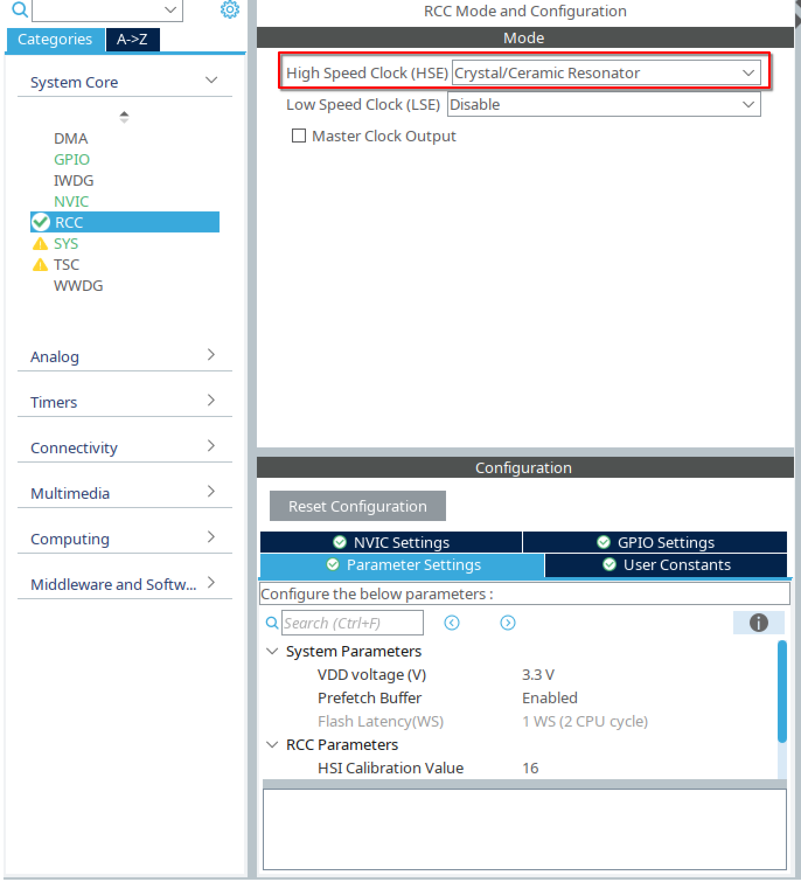
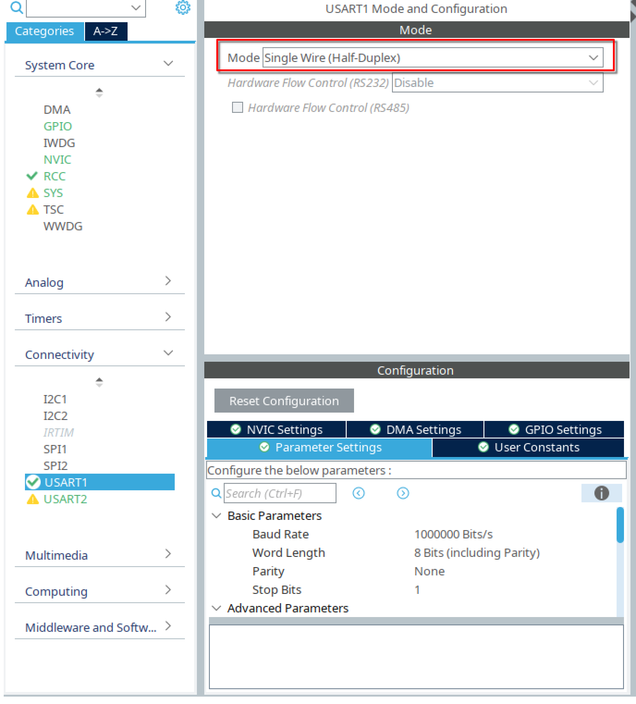
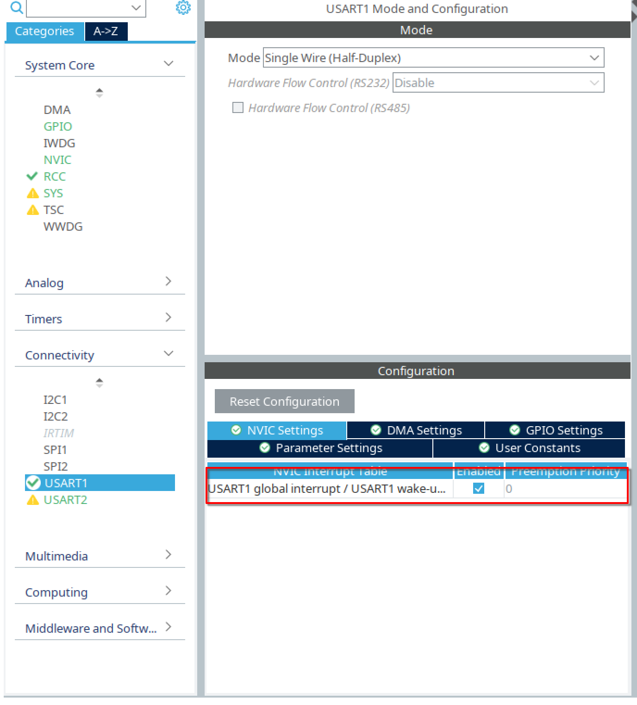
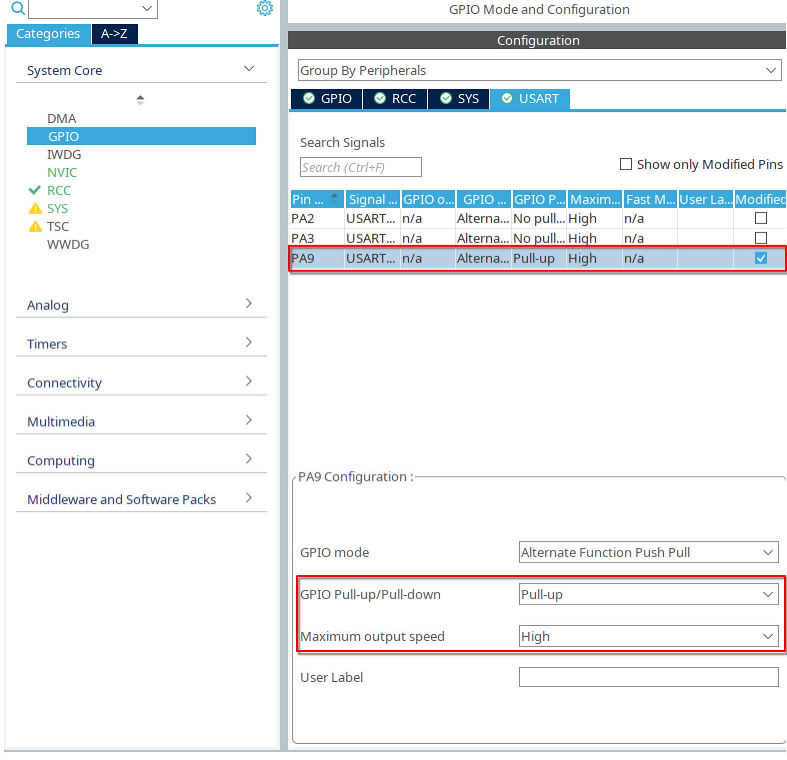

# AxelFlow  

AxelFlow is a highly adaptable serial bus servo driver designed for seamless integration with microcontroller-based development platforms. It enables efficient control of multiple servo motors over a single communication bus, making it an optimal solution for robotics, automation, and embedded systems applications. AxelFlow is built on Dynamixel Protocol 1.0, ensuring compatibility with all servos that support this protocol.  

When used with STM32 HAL, no additional hardware is required to switch the Full-Duplex UART signal to Half-Duplex, simplifying implementation.  

```c  
Status_Packet AxelFlow_fire(UART_HandleTypeDef *huart, Instruction_Packet ip)  
```  

This function handles the automatic switching between transmission (Tx) and reception (Rx) modes.  

## Features

- **Cross-Platform Compatibility**: Designed to work with any microcontroller, from Arduino to STM32, ESP32, and more.
- **Serial Bus Communication**: Utilizes a serial bus (Half-Duplex UART) for simple and scalable communication between multiple servo motors.
- **Efficient Motor Control**: Provides precise control of servo motors with configurable speed, position, and torque settings.
- **Flexible Interface**: Supports both hardware and software UART implementations.

## Getting Started

### Prerequisites

To get started with AxelFlow, you’ll need:

- A microcontroller (e.g., STM32, Arduino, ESP32)
- Servos compatible with the serial bus interface
- UART communication interface (hardware or software)
- Understanding of Dynamixel Protocol 1.0.

### Installation

Clone the repository to your local machine:

```bash
git clone https://github.com/SrikarBharadwajR/AxelFlow.git
```

## Setup for STM32 HAL

Follow these steps to configure your STM32 microcontroller for use with AxelFlow:  

### 1. Create a New Project in STM32CubeIDE  

- Open **STM32CubeIDE** and create a new project with your target microcontroller or development board.  

- Under **RCC settings**, select **Crystal/Ceramic Resonator** for **HSE (High-Speed External Clock)**.  
  

### 2. Configure USART for Servo Communication  

- Select the **USART** channel to be used for the servo. In this example, **USART1** is selected.  
- Set the **Mode** to **Half-Duplex**.  
- The **Baud Rate** and other parameters will be configured in the main code, so they can be left at default values.  
  

- Enable the **Global Interrupt** for the selected USART in the **NVIC** settings.  
  

- Set the **GPIO configuration** for the selected USART:  
  - **Pull-Up Mode** enabled.  
  - **Maximum Speed** set to **High**.  
  

### 3. Add AxelFlow Library Files  

Copy the following files into the respective project directories:  

- **Header Files (`Core/Inc/`):**  
  - `AxelFlow.h`  
  - `AxelFlow_Debug.h`  
  - `AxelFlow_Serial.h`  

- **Source Files (`Core/Src/`):**  
  - `AxelFlow.c`  
  - `AxelFlow_Debug.c`  
  - `AxelFlow_Serial.c`  

and make sure to change this line in `AxelFlow_Debug.h` to your appropriate microcontroller.

```c
#include "stm32f0xx_hal.h"
```

### 4. Include AxelFlow Headers  

In your **main.c** file, include the necessary headers:  

```c
/* Private includes ---------------------------------------------------------- */
/* USER CODE BEGIN Includes */
#include "AxelFlow.h"
#include "AxelFlow_Debug.h"
#include "AxelFlow_Serial.h"
/* USER CODE END Includes */
```

### 5. Define a Status Packet for Debugging  

```c
/* USER CODE BEGIN PV */
Status_Packet status;
/* USER CODE END PV */
```

### 6. Initialize Debugging (Optional)  

If debugging via **USART** is preferred, initialize the debug USART handle:  

```c
/* USER CODE BEGIN WHILE */
AxelFlow_debug_init(&huart2);
```

### 7. Initialize UART for Half-Duplex Communication  

Set up the UART handle for **Half-Duplex** communication with the serial bus servo at the appropriate baud rate:  

```c
UART_HandleTypeDef servo1_UART_Handle = AxelFlow_UART_Init(USART1, 1E6);
```

### 8. Create a Servo Instance  

Initialize the servo with its **ID**, the associated **UART handle**, and whether it is in **wheel mode**:  

```c
Servo servo1 = AxelFlow_servo_init(0x01, &servo1_UART_Handle, false);
```

### 9. Set Servo Limits  

Define the **clockwise (CW) and counterclockwise (CCW) limits** of the servo before the loop:  

```c
Status_Packet set_status = setCCWLimit(100, servo1);
print_status(set_status, 0);

set_status = setCWLimit(0, servo1);
print_status(set_status, 0);

HAL_Delay(10);
```

### 10. Example Loop: Move Servo Between 10° and 50°  

The following loop continuously moves the servo between **10° and 50°**, with a **100 ms delay** between movements:  

```c
while (1)
{
    status = setPosition(10, servo1);
    print_status(status, 0);
    HAL_Delay(100);

    status = setPosition(50, servo1);
    print_status(status, 0);
    HAL_Delay(100);

    /* USER CODE END WHILE */
}
```

## Platform Compatibility

AxelFlow is designed for adaptability across various microcontroller platforms. The library’s modular structure ensures easy integration with different hardware architectures by replacing platform-specific UART and debugging implementations.

### Adapting AxelFlow to Other Platforms

#### 1. **Replacing Platform-Specific UART Functions**

To port AxelFlow to another microcontroller, replace the following STM32-specific functions:

- `HAL_UART_Transmit()`
- `HAL_UART_Receive()`
- `HAL_HalfDuplex_Init()`

#### 2. **Modifying Serial Communication**

To ensure compatibility, implement the following functions using your platform’s UART API:

- **UART Initialization:**

  ```c
  void AxelFlow_UART_Init(UART_TypeDef *UART_ID, uint32_t baud_rate);
  ```

  Replace initialization with the appropriate UART configuration function.

- **Data Transmission:**

  ```c
  UART_Transmit_Function(&huartx, info_array, ip.Length + 4, TIMEOUT);
  ```

  Substitute with a suitable transmission method.

- **Data Reception:**

  ```c
  UART_Receive_Function(&huartx, Status_array, STATUS_FRAME_BUFFER, TIMEOUT);
  ```

  Modify to use either interrupt-based or polling-based reception.

#### 3. **Ensuring Proper Packet Handling**

AxelFlow processes communication packets using `struct_to_arr()` and `arr_to_struct()`. Maintain the packet format and checksum calculation when porting to a new platform.

#### 4. **Debugging Adaptation**

AxelFlow uses `AxelFlow_Debug` for serial debugging. Replace platform-specific functions with appropriate equivalents:

- **Initialize Debug UART:**

  ```c
  void AxelFlow_debug_init(Debug_Interface_Type *debug_interface);
  ```

  Adapt `Debug_Interface_Type` to match your platform’s debugging mechanism.

- **Printing Debug Messages:**

  ```c
  Debug_Function_Print(char *str);
  Debug_Function_Println(char *str);
  ```

  Modify these to use the relevant debugging output function.

## References

The following documents were consulted during the development of this project:  

- [Dynamixel Protocol 1.0 Documentation](https://emanual.robotis.com/docs/en/dxl/protocol1/)  
- [AX-12A Servo Documentation](https://emanual.robotis.com/docs/en/dxl/ax/ax-12a/)  
- [AX12 Control for STM32F4 by kentdev](https://github.com/kentdev/AX12-Control-STM32F4)  

## Public Function Descriptions

### `AxelFlow_servo_init`

```c
Servo AxelFlow_servo_init(uint8_t id, UART_HandleTypeDef *huartx, bool jointMode)
```

Initializes a servo with the given ID, UART handle, and mode.

---

### `getCCWLimit`

```c
uint16_t getCCWLimit(Servo servo)
```

Retrieves the counterclockwise angle limit of a servo.

---

### `setCCWLimit`

```c
Status_Packet setCCWLimit(float max_angle, Servo servo)
```

Sets the counterclockwise angle limit of a servo.

---

### `getCWLimit`

```c
uint16_t getCWLimit(Servo servo)
```

Retrieves the clockwise angle limit of a servo.

---

### `setCWLimit`

```c
Status_Packet setCWLimit(float max_angle, Servo servo)
```

Sets the clockwise angle limit of a servo.

---

### `setPosition`

```c
Status_Packet setPosition(float angle, Servo servo)
```

Sets the servo position to a specified angle.

---

### `setMaxTorque`

```c
Status_Packet setMaxTorque(float torque, Servo servo)
```

Sets the maximum torque of a servo (0 to 100%).

---

### `getMaxTorque`

```c
float getMaxTorque(Servo servo)
```

Retrieves the maximum torque of a servo.

---

### `setRunningTorque`

```c
Status_Packet setRunningTorque(float torque, Servo servo)
```

Sets the running torque of a servo (0 to 100%).

---

### `setSpeed`

```c
Status_Packet setSpeed(float speed, Servo servo)
```

Sets the speed of a servo in percentage (0 to 100%).

---

### `setSpeedinRPM`

```c
Status_Packet setSpeedinRPM(float rpm, Servo servo)
```

Sets the speed of a servo in RPM.

---

### `controlLED`

```c
Status_Packet controlLED(bool state, Servo servo)
```

Controls the LED state of a servo (on/off).

---

### `getLEDStatus`

```c
uint8_t getLEDStatus(Servo servo)
```

Retrieves the LED status of a servo (on/off).

---

### `getPositionAngle`

```c
float getPositionAngle(Servo servo)
```

Converts the servo's position to an angle in degrees.

---

### `getSpeedRPM`

```c
float getSpeedRPM(Servo servo)
```

Converts the servo's speed to rotations per minute (RPM).

---

### `reboot`

```c
Status_Packet reboot(Servo servo)
```

Reboots the given servo.

---

### `ping`

```c
bool ping(Servo servo)
```

Pings the given servo to check if it's connected and responding.

---

### `changeServoID`

```c
Status_Packet changeServoID(uint8_t future_ID, Servo servo)
```

Changes the ID of the given servo to a new value.

---

### `changeBaudRate`

```c
Status_Packet changeBaudRate(uint32_t new_Baud_Rate, Servo servo)
```

Changes the baud rate of the given servo to the specified value.

---

### `forceSetPosition`

```c
Status_Packet forceSetPosition(uint16_t angle, Servo servo)
```

Sets the position of the given servo to a specific angle, retrying until the position is reached.

---

### `getFirmwareVersion`

```c
uint8_t getFirmwareVersion(Servo servo)
```

Reads and returns the firmware version of the given servo.

---

### `scanID`

```c
uint8_t scanID(Servo servo)
```

Scans for a valid servo ID by pinging each ID in the available range.

### `scanBaudRate`

```c
uint32_t scanBaudRate(Servo servo)
```

Scans and returns the supported baud rate by testing each baud rate from a predefined list.

---

### `getResponseDelayTime`

```c
uint16_t getResponseDelayTime(Servo servo)
```

Retrieves the response delay time for a servo.

---

### `setResponseDelayTime`

```c
Status_Packet setResponseDelayTime(uint16_t response_time, Servo servo)
```

Sets the response delay time for a servo.

---

### `getTemperatureLimit`

```c
uint8_t getTemperatureLimit(Servo servo)
```

Retrieves the temperature limit for a servo.

---

### `setMinVoltageLimit`

```c
Status_Packet setMinVoltageLimit(float min_voltage, Servo servo)
```

Sets the minimum voltage limit for a servo.

---

### `getMinVoltageLimit`

```c
uint8_t getMinVoltageLimit(Servo servo)
```

Retrieves the minimum voltage limit for a servo.

---

### `setMaxVoltageLimit`

```c
Status_Packet setMaxVoltageLimit(float max_voltage, Servo servo)
```

Sets the maximum voltage limit for a servo.

---

### `getMaxVoltageLimit`

```c
uint8_t getMaxVoltageLimit(Servo servo)
```

Retrieves the maximum voltage limit for a servo.

---

### `setTemperatureLimit`

```c
Status_Packet setTemperatureLimit(float max_temp, Servo servo)
```

Sets the temperature limit for a servo.

---

### `getStatusReturnLevel`

```c
uint8_t getStatusReturnLevel(Servo servo)
```

Retrieves the status return level for a servo.

---

### `setStatusReturnLevel`

```c
Status_Packet setStatusReturnLevel(uint8_t status, Servo servo)
```

Sets the status return level for a servo.

---

### `getAlarmLEDStatus`

```c
uint8_t getAlarmLEDStatus(Servo servo)
```

Retrieves the alarm LED status for a servo.

---

### `setAlarmLEDStatus`

```c
Status_Packet setAlarmLEDStatus(uint8_t status, Servo servo)
```

Sets the alarm LED status for a servo.

---

### `getShutdownStatus`

```c
uint8_t getShutdownStatus(Servo servo)
```

Retrieves the shutdown status for a servo.

---

### `setShutdownStatus`

```c
Status_Packet setShutdownStatus(uint8_t status, Servo servo)
```

Sets the shutdown status for a servo.

---

### `getTorqueEnableStatus`

```c
uint8_t getTorqueEnableStatus(Servo servo)
```

Retrieves the torque enable status for a servo.

---

### `setTorqueEnableStatus`

```c
Status_Packet setTorqueEnableStatus(bool enable, Servo servo)
```

Sets the torque enable status for a servo.

---

### `setWheelMode`

```c
void setWheelMode(Servo servo)
```

Sets the servo to wheel mode by configuring the counterclockwise and clockwise limits to be 0. 1 worked the best by hit and trial.

---

### `getPresentLoad`

```c
float getPresentLoad(Servo servo)
```

Retrieves the present load value for a servo.

---

### `getPresentTemperature`

```c
float getPresentTemperature(Servo servo)
```

Retrieves the present temperature of a servo.

---

### `getPresentVoltage`

```c
float getPresentVoltage(Servo servo)
```

Retrieves the present voltage for a servo.

---

### `getRegistered`

```c
uint8_t getRegistered(Servo servo)
```

Retrieves the registration status of a servo.

---

### `getMoving`

```c
uint8_t getMoving(Servo servo)
```

Retrieves the moving status of a servo.

---

### `getLockStatus`

```c
uint8_t getLockStatus(Servo servo)
```

Retrieves the lock status for a servo.

---

### `setPunch`

```c
Status_Packet setPunch(float punch, Servo servo)
```

Sets the punch value for a servo.

---

### `getPunch`

```c
float getPunch(Servo servo)
```

Retrieves the punch value for a servo.

---

### `print_status`

```c
void print_status(Status_Packet packet, bool just_Errors)
```

Prints the status of a servo, optionally filtering only errors.
